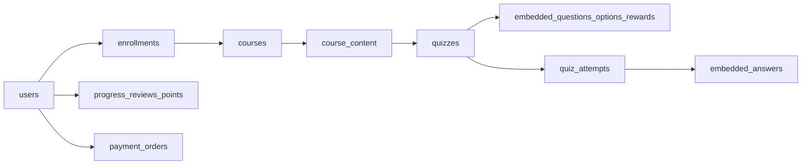

# Learnova

Learnova is an eLearning platform with two product surfaces:

- learner-facing website
- instructor/admin backoffice

This repository contains the React frontend, the FastAPI backend, MongoDB application storage, historical SQL migration assets, and shared route/data contracts used across both sides.

## Stack

- Frontend: React 18 + Vite
- Routing: React Router
- PDF viewing: `pdfjs-dist`
- Backend: FastAPI + MongoDB (replica set)
- Python DB drivers: `psycopg` or `psycopg2`
- Shared contracts: `shared/types/common_types.ts`

## Repo Structure

```plaintext
.
|- backend/
|  |- config/
|  |- db/
|  |- middleware/
|  |- modules/
|  `- main.py
|- shared/
|  |- constants/
|  `- types/
`- src/
   |- components/
   |- context/
   |- data/
   |- pages/
   |- styles/
   |- utils/
   |- App.jsx
   `- main.jsx
```

## Product Areas

### Learner Side

Implemented learner flows include:

- login and signup
- role-based auth entry
- Google sign-in entry support
- My Courses dashboard
- course detail page
- reviews page
- payment flow
- fullscreen lesson player
- document, video, and quiz route states
- quiz intro, question, and reward flow
- points and badge profile panel
- PDF.js viewer with lazy loading, fullscreen support, and keyboard shortcuts

### Instructor/Admin Side

The repo also includes instructor/admin routes and backend modules for:

- course creation and editing
- publishing and unpublishing
- attendee management
- content management
- quiz builder persistence
- reporting dashboard data
- uploads

## Frontend Architecture

The frontend uses a page/component-based layered structure.

```plaintext
src/
|- components/
|- context/
|- data/
|- pages/
|- styles/
|- utils/
|- App.jsx
`- main.jsx
```

Rules for frontend work:

- route-level screens belong in `src/pages`
- reusable UI belongs in `src/components`
- mock or generated demo data belongs in `src/data`
- helpers and route builders belong in `src/utils`
- shared styling belongs in `src/styles/app.css`
- do not introduce a second frontend architecture such as `src/modules/*` or `src/features/*`

## Backend Architecture

The backend is organized by capability inside `backend/modules`.

### Auth

- `backend/modules/auth/router.py`
- `backend/modules/auth/service.py`
- `backend/modules/auth/schemas.py`
- `backend/modules/auth/dependencies.py`

Responsibilities:

- register/login
- current user lookup
- token validation
- role guards

### Courses

- `backend/modules/courses/router.py`
- `backend/modules/courses/service.py`
- `backend/modules/courses/schemas.py`

Responsibilities:

- learner dashboard data
- course detail and reviews
- lesson/content loading
- progress updates
- quiz attempts and scoring
- enrollment and payment flow

### Admin

- `backend/modules/admin/router.py`
- `backend/modules/admin/service.py`
- `backend/modules/admin/schemas.py`

Responsibilities:

- admin/instructor course CRUD
- content CRUD
- quiz CRUD
- attendees
- uploads
- reporting

## Main Routes

### Frontend Routes

- `/auth/login`
- `/auth/signup`
- `/auth/forgot-password`
- `/my-courses`
- `/courses/:courseId`
- `/courses/:courseId/reviews`
- `/courses/:courseId/payment`
- `/courses/:courseId/learn/:contentId/document`
- `/courses/:courseId/learn/:contentId/video`
- `/courses/:courseId/learn/:contentId/quiz`
- `/courses/:courseId/learn/:contentId/quiz/question/:questionIndex`
- `/courses/:courseId/learn/:contentId/quiz/reward`

### Backend API Routes

#### Auth

- `POST /auth/register`
- `POST /auth/login`
- `POST /auth/google`
- `GET /auth/me`

#### Learner Courses

- `GET /courses`
- `POST /courses/{course_slug}/enroll`
- `GET /courses/{course_slug}`
- `GET /courses/{course_slug}/reviews`
- `POST /courses/{course_slug}/reviews`
- `POST /courses/{course_slug}/payments/order`
- `POST /courses/{course_slug}/payments/verify`
- `GET /courses/{course_slug}/content/{content_slug}`
- `POST /courses/{course_slug}/content/{content_slug}/progress`
- `GET /courses/{course_slug}/quizzes/{content_slug}`
- `POST /courses/{course_slug}/quizzes/{content_slug}/attempts`

#### Admin

- `GET /admin/courses`
- `POST /admin/courses`
- `GET /admin/courses/{course_slug}`
- `PUT /admin/courses/{course_slug}`
- `DELETE /admin/courses/{course_slug}`
- `POST /admin/courses/{course_slug}/publish`
- `GET /admin/courses/{course_slug}/attendees`
- `POST /admin/courses/{course_slug}/attendees`
- `GET /admin/courses/{course_slug}/content`
- `POST /admin/courses/{course_slug}/content`
- `GET /admin/content/{content_slug}`
- `PUT /admin/content/{content_slug}`
- `DELETE /admin/content/{content_slug}`
- `GET /admin/courses/{course_slug}/quizzes`
- `POST /admin/courses/{course_slug}/quizzes`
- `GET /admin/quizzes/{quiz_id}`
- `PUT /admin/quizzes/{quiz_id}`
- `DELETE /admin/quizzes/{quiz_id}`
- `POST /admin/uploads`
- `GET /admin/reports/course-progress`

## Database

MongoDB stores users, courses, content, enrollments, progress, quizzes/attempts,
points, reviews and payments. Questions/options, attachments and quiz answers
are embedded; UUID strings preserve existing API identities. Transactions and
unique indexes protect enrollment, quiz rewards and payment access.



The document model fits variable lesson metadata and keeps quiz questions/options
in one aggregate. Cross-document access, rewards and payments still require
references, indexes and transactions. The choice fulfills the NoSQL project
requirement; performance is measured rather than assumed.

A replica set is required, including for local development. Runtime schema
manifests live under `backend/db/mongo/specs`; setup is explicit and repeatable:

```powershell
.\.venv\Scripts\python.exe -m backend.db.mongo.setup --apply
```

Configure `.env` from `.env.example` first. Setup does not import or delete data.
The first registration in a new empty database claims the administrator slot;
existing imports preserve roles and access. Do not seed demo credentials into
an imported database.

SQL files under `backend/db` and PostgreSQL services remain historical export/
rollback assets. They are not the active setup path. Optional migration tools
require `backend/requirements-migration.txt`; see
[transfer and recovery](backend/db/migration/PHASE_9_10.md).

## Bulk Data Generation

Use `python -m backend.db.migration.workload --help` for isolated, synthetic
MongoDB volume fixtures and query measurements. The tool requires a frozen
export, a separate unique test database and explicit apply/write-pause flags.
Never load generated SQL into the active application database.

## Local Development

### Frontend

```bash
npm install
npm run dev
```

Build:

```bash
npm run build
```

### Backend

Create a local Python environment and install backend dependencies (PowerShell):

```powershell
python -m venv .venv
.\.venv\Scripts\python.exe -m pip install -r backend/requirements.txt
```

Run the API:

```powershell
.\.venv\Scripts\python.exe -m uvicorn backend.main:app --reload
```

For verification, install `backend/requirements-dev.txt`, then run
`python -m pytest backend/tests`,
`node --test src/utils/quizSubmission.test.js src/utils/paymentVerification.test.js`,
and `npm.cmd run build`.

All application selectors must be `mongo` for MongoDB-only operation. The
PostgreSQL driver is excluded from runtime requirements and retained only in
optional migration/development requirements. `/db/health` and `/mongo/health`
check MongoDB in this mode; `/health` checks the application process.

For an existing project, preserve and migrate its data before switching storage.
The guarded cutover command is `python -m backend.db.migration.cutover --help`.
It requires accepted verification evidence and leaves writes paused until the
post-restart smoke checks pass. It retains the previous environment privately.

## Environment

Frontend:

```env
VITE_GOOGLE_CLIENT_ID=
VITE_API_BASE_URL=
```

Backend settings are documented in `.env.example`: `MONGODB_URI`,
`MONGODB_DB=learnova`, all three `*_STORAGE=mongo` selectors and a private
`JWT_SECRET`. Payment/Google credentials are optional until those integrations
are used. Never commit `.env`, credentials, database exports or private backups.

`APPLICATION_WRITES_PAUSED=true` blocks mutations during migration (local login
and reads remain available). Restart the backend after configuration changes.
Only reopen writes after final verification. Lossless rollback after new MongoDB
writes requires reconciliation with PostgreSQL; changing selectors alone loses
those writes. Backups are retained under ignored `.local/` until a separate
retention/deletion decision.

## Demo Data

`VITE_DEMO_MODE=false` is the default. Live catalog/report responses are no longer
padded to artificial row counts, and API failures show errors rather than
synthetic records. Set `VITE_DEMO_MODE=true` only for an explicit frontend demo,
and restart/rebuild Vite after changing it.

## Working Rules

### File Metadata

Source files should include a short metadata header such as:

```js
/*
 * File: ExamplePage.jsx
 * Owner: KARDAM | YUG | BOTH CAN ADD
 * Purpose: One-line reason this file exists.
 * What it is: Short description of what this file renders or controls.
 */
```

### Ownership

Ownership markers used in the repo:

- `KARDAM`
- `YUG`
- `BOTH CAN ADD`

### UI Conventions

- use SVG icons only
- do not use emojis as UI icons
- preserve the existing navbar, card, border, and spacing language
- keep light/dark theme support aligned with current CSS variables
- reuse the current page/component structure instead of introducing a second UI system

### Workflow

Recommended flow:

1. pull latest changes
2. work in the appropriate branch
3. keep commits focused
4. build and test locally
5. push the branch
6. merge into `main`

Suggested commit prefixes:

- `feat:`
- `fix:`
- `docs:`
- `chore:`
- `refactor:`

### Current Responsibility Split

Kardam:

- learner-side frontend
- auth frontend
- learner navigation and UX
- shared frontend visual system

Yug:

- backend logic
- instructor/admin implementation
- API wiring
- domain and data flow

Shared:

- integration
- shared contracts and constants
- QA
- bug fixes

## Priority Order

1. keep learner flow stable
2. keep instructor/admin flow aligned with the same frontend system
3. connect live backend APIs across the learner pages
4. replace small mock-only flows with integrated data
5. finish reporting, persistence, and QA
